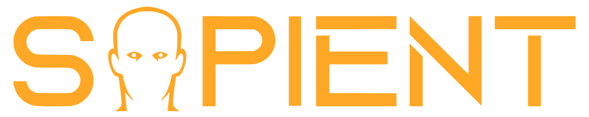

> ## Finding to the fun fast is critical in game development”

Game development is an iterative process that demands rapidly testing multiple concepts in order to "discover the fun" that results in a great game. However while current tools have rapidly improved, development costs to build high-quality games continues to skyrocket and can **[exceed $1 billion](https://www.ign.com/articles/major-publishers-report-aaa-franchises-can-cost-over-a-billion-to-make)**. 

#### Problem Today &nbsp; 👎🏻
- Engineering is overwhelmed by **relentless crunch** deadlines.
- Designers **lack tools** to bring ideas to life.
- Creativity suffers, **studios shut down**, *rise & repeat*.

## 🎮 &nbsp; Meet Sapient 

##### 🪄✨ _"What can I help you build?" 

**Sapient is a AI-powered game mechanics development tool designed to drastically shorten development timelines, so studios achieve their vision faster.**

---

## ♨️ &nbsp; Secret Sauce 
#### Enterprise Scale &nbsp; 🚀
  - **Easy Installation**: Get started in minutes! 
  - **Game Engine Integration**: Supports all major game engines.
  - **Enterprise Support**: Dedicated assistance for your team's needs.

#### System-Aware Intelligence &nbsp; 🤓
  - **Understands Your Project**: Intelligently adapts to your game.
  - **Optimized for Your Systems**: Understands your architecture and infrastructure.
  - **Adaptive Learning**: Learns your workflows to improve over time.

#### GenAI Powered &nbsp; :robot:
  - **Design Assistants**: It's like adding additional designers and devs to your team.
  - **Accelerate Development**: Slash development times & *find to the fun faster*.
  - **Future-Ready**: Leverage cutting-edge generative AI agentic technology.

---

>**Our Mission** &nbsp; 🏆" 
    Help game developers push the boundaries of creativity and accelerate innovation by equipping them with  tools that break technical barriers to entry.

---

## ⚡ &nbsp; Quickstart
Sapient integrates directly into **Unreal Engine**! (Unity *Coming Soon*)


**1. Navigate to your Project's Plugins Source Directory**
```cmd
    cd MyProject\Plugins
```
**2. Clone Sapient Unreal Engine Plugin from Github**
```bash
git clone https://github.com/sapient-technology/sapient-unreal.git
```

Alternatively if not using Git, you can download the plugin folder
and proceed to step 3.

**3. Enable Sapient Plugin in Unreal Engine**    
```
Unreal Engine >> Edit > Plugins > Sapient > Click [Checkbox] to Enable
```
**4. Add API Key** 
```
Unreal Engine >> Edit > Project Settings > Sapient > Enter API Key
```
**5. Load Plugin & Go**
```
Unreal Engine >> Window > Sapient > [Enter Prompt]
```
    
## 📖 &nbsp; [Documentation](https://upgraded-chainsaw-v7enkml.pages.github.io)
**Learn more Sapient [Docs!](https://upgraded-chainsaw-v7enkml.pages.github.io)** 👀

---

## 🤗 &nbsp; Get in Touch!

- **❓ &nbsp; Get Support**: Ask our community on &nbsp; 👉🏼 &nbsp; Discord **[#community-support](https://discord.gg/MVCvNgNQ7G)**.
  
- **💡 &nbsp; Feature Request**: Ping us on &nbsp; 👉🏼 &nbsp; Discord **[ #general](https://discord.gg/MVCvNgNQ7G)**.
  
- **🐞 &nbsp; Report Issues**: Find a bug? Flag it on **[GitHub Issues](https://github.com/sapient-technology/sapient-unreal/issues)**.

- **📢 &nbsp; Follow Us**: Stay updated by following **[LinkedIn](https://www.linkedin.com/company/sapient-tech/)**.

- **📧 &nbsp; Drop Us a Note**: Reach out via **[Email](mailto:info@sapientstudio.com)**.

---


!!! info "Legal Notice"
    By using Sapient and related Sapient services (such as the Sapient Unreal Engine Plugin), you are agreeing to our [Privacy Policy](https://www.sapientstudio.com/) and [Terms of Service](https://www.sapientstudio.com/).


<div style="font-size: 12px; color: #777; text-align: center;">
  Copyright &copy; 2024 - 2025 Sapient Technology, Inc.
</div>