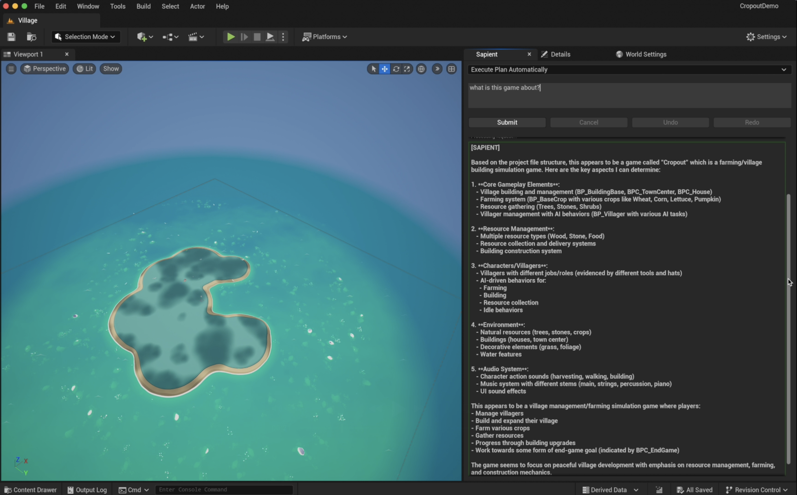
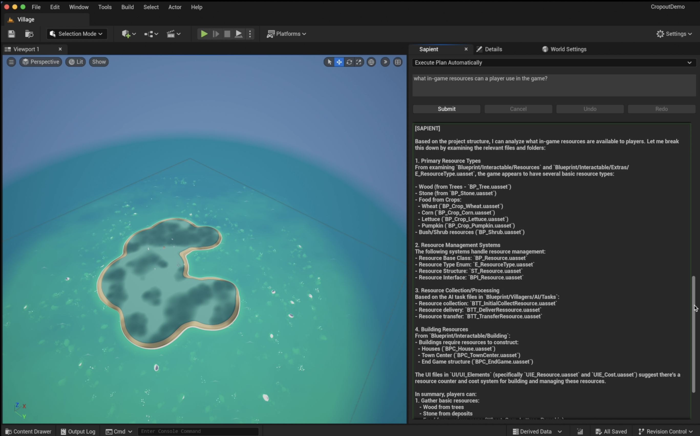
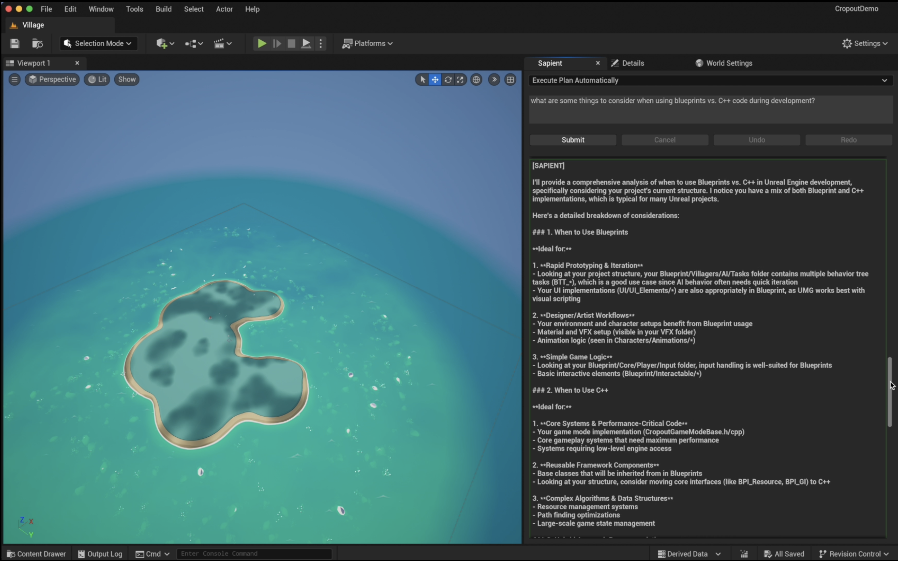
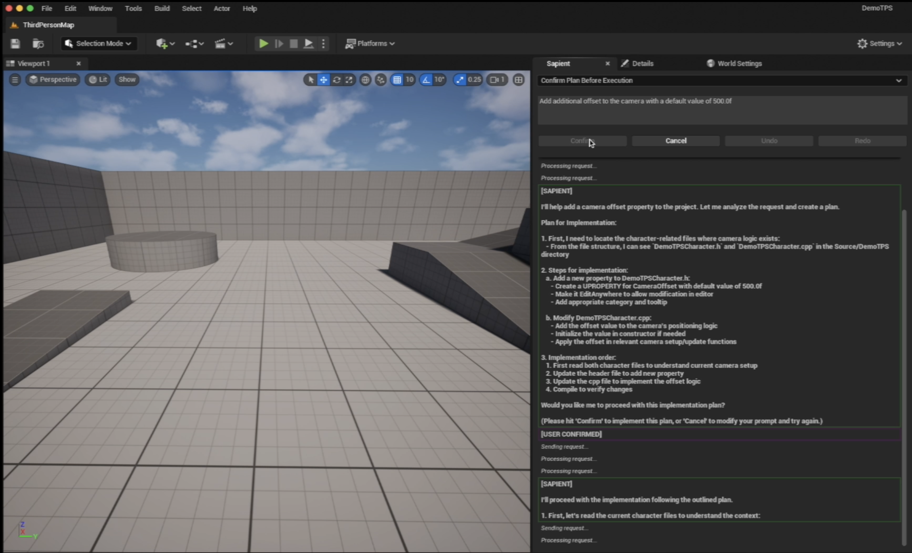
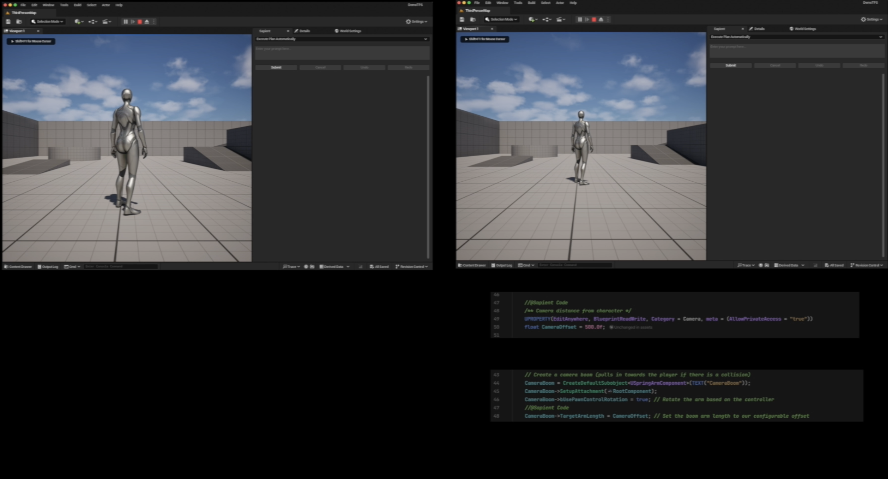
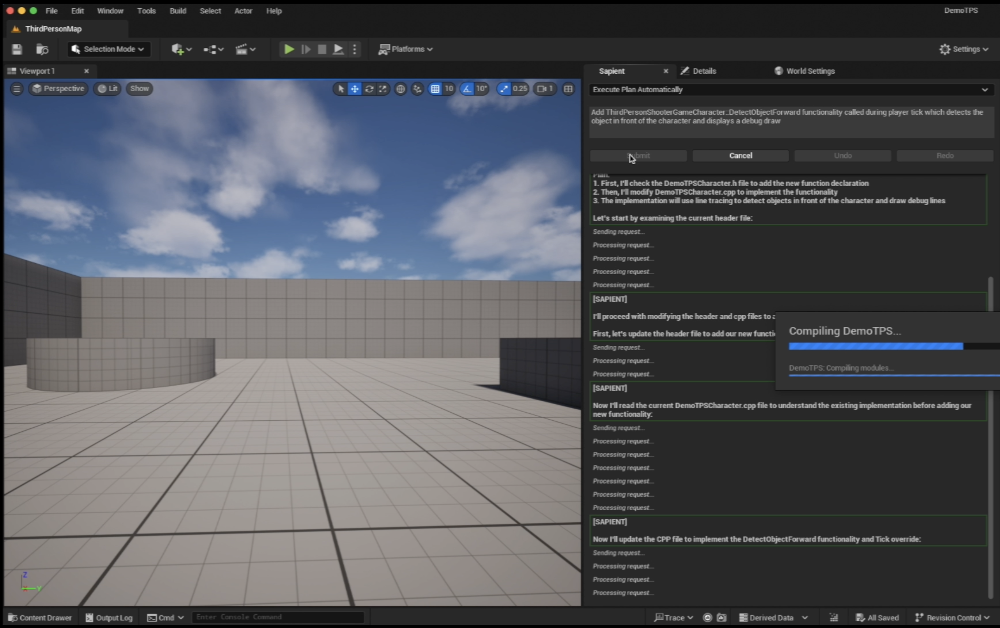
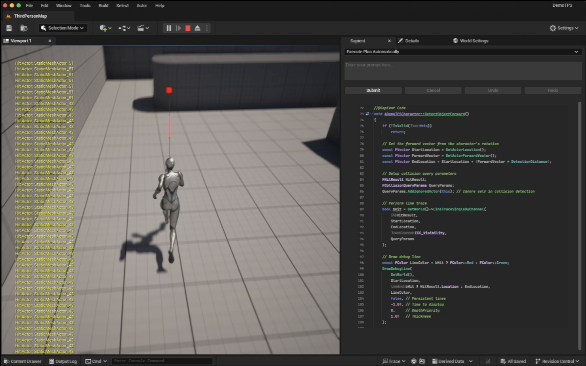
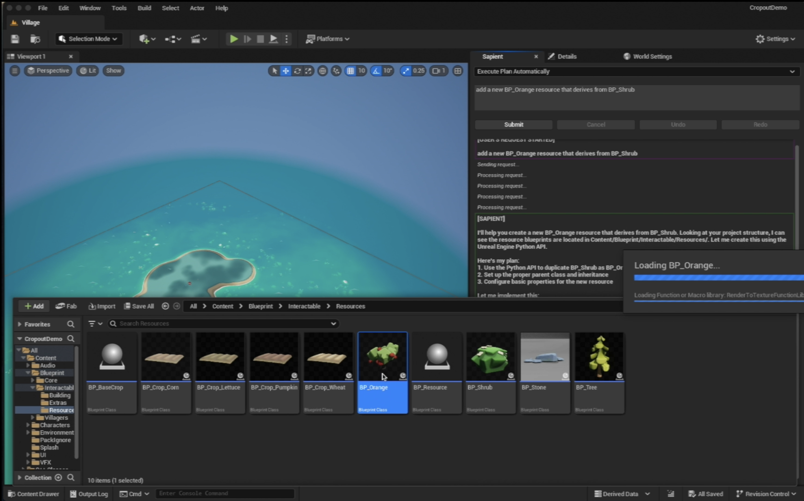
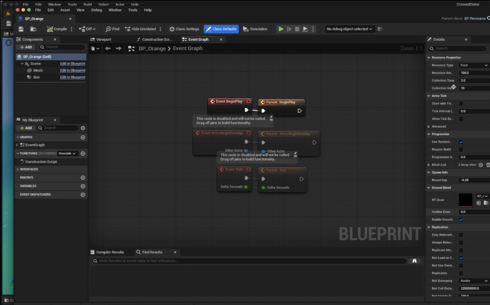

# Getting Started

!!! warning "Active Development"
    - Sapient is in active development with closed use only for strategic partners. 
    - Please report any issues to help us make it better for you and those who follow!

This page showcases example usage scenarios to help customers become familiar with Sapient's capabilities and how to effectively utilize them. By exploring these examples, users can gain insights into how Sapient can enhance their projects and streamline their workflows.

!!! note "Sample Game Environment"
    Reminder that Sapient integrates into your project. This means the results you get will reflect your projects architecture including code, assets, and project setup. Examples in the sample videos below use **Unreal Engine 5+** sample games. Specifically:

    - [Cropout Sample Project](https://www.unrealengine.com/en-US/blog/cropout-casual-rts-game-sample-project)
    - [Third Person Shooter Template](https://dev.epicgames.com/documentation/en-us/unreal-engine/third-person-template-in-unreal-engine)
    - [First Person Template](https://dev.epicgames.com/documentation/en-us/unreal-engine/first-person-template-in-unreal-engine)

### System-Aware Intelligence

!!! tip "Key Feature"
    - Understands your project, your workflows, and your systems for personalized support.
    - Adapts to your specific game architecture and infrastructure.
    - Provides intelligent recommendations and optimizations tailored to your project.

!!! example "**Query:** "What is this game about?""
    Sapient returns detailed game-specific information about the sample game ([Cropout](https://www.unrealengine.com/en-US/blog/cropout-casual-rts-game-sample-project)).
    It outlines the game's core systems, assets, and even the type and genre of game!



!!! example "**Query:** "What game resources can a player use in this game?""
    Sapient will even explain the key in-game mechanics. Here it
    summarizes the key game resources like "food, wood, stone" and game
    strategy e.g. "real-time sims game about harvesting resources". 



### [Beta] Unreal Engine Expert Assistant

!!! tip "Key Feature"
    - Collaboratively works with your teams, making them more productive.
    - Offers expert guidance and support for Unreal Engine development.
    - Helps troubleshoot issues and provides best practices to streamline your workflow.

!!! example General Unreal Engine Assistance
    **Query:** "What should I consider when choosing between Blueprints vs C++ development?"
    
    Sapient can act as a general UE game development while still taking into account
    your game's specific setup. Here Sapient return general best practices for 
    Blueprints vs C++ first. Then Sapient calls out specific considerations
    given your current game progress and architecture.



!!! info "Helpful Tip!"
    For the best guidance we recommend:

    - Clearly specifying if your prompt is a question or implementation:
    ```text 
    Question - how would I use the GAS within my game...?    
    ```
    ```text
    Please implement a double jump mechanic within my CharacterController class...
    ```


### [Beta] Unreal Engine Code Architect

!!! tip "Key Feature"
    - Collaboratively generates game mechanics based on your project goals.
    - Assists in designing and implementing complex game systems.
    - Ensures that your code is optimized and adheres to industry standards.

!!! example "Creating or modifying game mechanics: *Camera*" 
    **Query:** "Add additional offset to the camera with a default value of 500.0f"





!!! example "Creating or modifying game mechanics: *Player Controller*" 
    **Query:** "Add DetectObjectForward functionality called during player tick which detects the object in front of character and display a debug draw"





!!! tip "Tip"
    - **Debugging** - Sapient also is useful for debugging code/assets and root cause analysis 🤗
    - **Iterative Tasks** - Sapient performs best when tasks are completed iteratively once.
    ```text
     "I'm building an inventory system for players. First, build ..."
    ```
    - **Review Output** - Sapient can make mistakes! Make sure to review all output. 

### [Alpha] Unreal Engine Asset Architect

!!! warning In Active Development & Experimental

!!! tip "Key Feature"
    - Improved support for game engine assets like Data Tables, Blueprints, & more 
  
!!! example "Creating or modifying game assets - *Blueprints*"  
    **Query:** "Add a new BP_Orange resource that derives from BP_Shrub"




